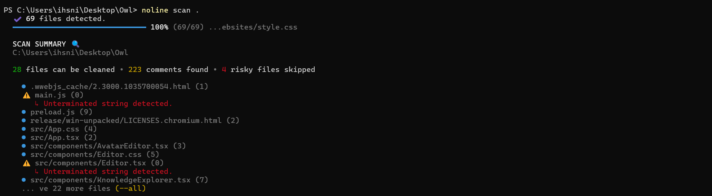
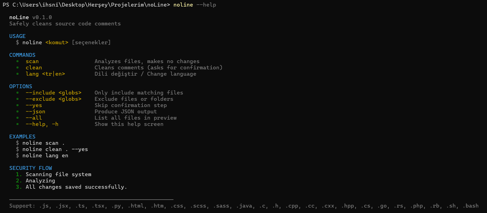
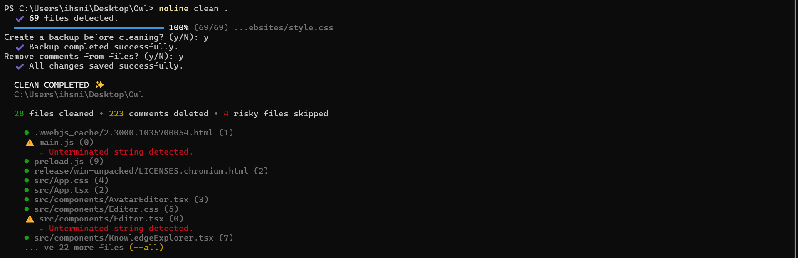

<p align="center">
  <h1 align="center">noLine</h1>
  <p align="center">
    A safe and modern CLI tool that scans your source code, previews comments, and cleans them with confirmation.
  </p>
  <p align="center">
    
    = 20" />
    
    
  </p>
</p>

---

## Quick Look

`noLine` scans the selected directory, analyzes comments in supported files, and provides a safe preview before cleaning.



---

## Quick Start

Run it immediately without installation:

```bash
npx @ihsnishnogl/noline scan .
```

---

## Features

| Feature | Description |
| --- | --- |
| **Safe Preview** | Provides a detailed analysis report before removing any comments. |
| **Auto Backup** | Protects your data by creating a project backup before cleaning. |
| **Risk Protection** | Detects unterminated strings or broken code structures and skips them for safety. |
| **Flexible Filtering** | Processes only the files or folders you want based on your criteria. |
| **Multi-Language Support** | Switch between Turkish and English with a single command. |
| **JSON Support** | Outputs results in a machine-readable format for automation. |

---

## Installation

Install globally via npm:

```bash
npm install -g @ihsnishnogl/noline
```

Or for local development:

```bash
# 1. Clone the repo
git clone https://github.com/ihsnishnogl/noLine.git

# 2. Enter the directory
cd noLine

# 3. Install dependencies
npm install

# 4. Build the project
npm run build

# 5. Link globally (Optional)
npm link
```

---

## Usage

### Core Commands

```bash
# Scan files and show a summary
noline scan .

# Safely clean comments (asks for backup and confirmation)
noline clean .

# Change language (tr | en)
noline lang en
```




### Examples

```bash
# Only process TypeScript files under src
noline scan ./src --include "**/*.ts"

# Exclude node_modules and dist folders
noline clean . --exclude "node_modules/**,dist/**"

# Clean quickly by skipping confirmation steps
noline clean . --yes

# See all files in the preview list
noline scan . --all
```

---

## Security Flow

1. **Analysis:** Files are scanned and comment lines are identified.
2. **Risk Check:** If a quote or block comment is left open, the file is marked as "RISKY" and not modified.
3. **Backup:** During the `clean` process, you are asked if a backup should be created. If confirmed, a copy of the project is created with the `-backup` suffix.
4. **Confirmation:** After a final confirmation, comments are safely removed.




---

## License

[MIT](./LICENSE)